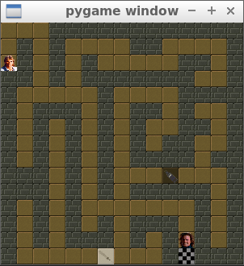

# OpenClassrooms - Python - Project 3
This is the 3rd project from https://openclassrooms.com/fr/paths/68-developpeur-dapplication-python

The objective is to write a simple maze game to learn Python

[The coding steps (only in french)](doc/projet_3.md) 

----

if you want to try:

## Installation

    git clone git@github.com:Zepmanbc/oc_dapython_pr3.git

    cd oc_dapython_pr3

    virtualenv env -p python3

    python env/bin/activate

    pip install -r requirements.txt

## Lauch the game

(don't forget to activate the virtualenv)

    python main

## How to play

Use arrow keys to move MacGyver

Press Q to quit anytime

You must take the 2 items before going to the guardian and exit

Enjoy...