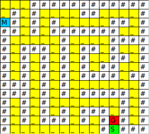
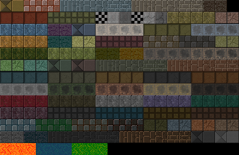

# Projet 3 : Aidez MacGyver à s'échapper

## Objectif

Réaliser un jeu de labyrinthe

## Cahier des charges
* Il n'y a qu'un seul niveau. La structure (départ, emplacement des murs, arrivée), devra être enregistrée dans un fichier pour la modifier facilement au besoin.
* MacGyver sera contrôlé par les touches directionnelles du clavier.
* Les objets seront répartis aléatoirement dans le labyrinthe et changeront d’emplacement si l'utilisateur ferme le jeu et le relance.
* La fenêtre du jeu sera un carré pouvant afficher 15 sprites sur la longueur.
* MacGyver devra donc se déplacer de case en case, avec 15 cases sur la longueur de la fenêtre !
* Il récupèrera un objet simplement en se déplaçant dessus.
* Le programme s'arrête uniquement si MacGyver a bien récupéré tous les objets et trouvé la sortie du labyrinthe. S'il n'a pas tous les objets et qu'il se présente devant le garde, il meurt (la vie est cruelle pour les héros).
* Le programme sera standalone, c'est-à-dire qu'il pourra être exécuté sur n'importe quel ordinateur.

## Réalisation

### Initialisation
----
J'ai créé un repository sur GitHub https://github.com/Zepmanbc/oc_dapython_pr3

j'ai cloné ce repo sur mon pc

    git clone git@github.com:Zepmanbc/oc_dapython_pr3.git

Je me suis positionné dans le répertoire qui a été créé afin de créer un environnement virtuel basé sur python 3

    cd oc_dapython_pr3/
    virtualenv env -p python3

je crée le *.gitignore* pour y ajouter le dossier *env/* qui vient d'être créé

    touch .gitignore

j'active l'environnement virtuel et j'installe pygame

    . env/bin/activate
    pip install pygame

J'écris une description du projet à venir dans le *README*

je fais mon 1er commit pour l'initialisation du projet

    git add .
    git commit -m "init the repo"

### Préparation
----
Je décide de créer un fichier *map* qui servira de base pour construire le labyrinthe.

Je remplis un tableau de 15×15 avec les éléments fixes
* \# représentant un mur
* _ le chemin
* M MacGyver
* G le garde
* S la sortie

### Découpage du code
----
Je vais faire une fonction qui lit le fichier *map* et remplis un tableau à 2 dimensions qui servira à positionner les éléments dans la fenêtre.

Ce tableau sera mis à jour en fonction des événements et permettra de rafraichir l'affichage.

je vais gérer MacGyver, le garde et les diférents éléments en tant qu'objets.

* MacGyver : il aura une position, une liste d'objets possédé ou pas.

* le Garde : il a une position et un status d'affichage.

* les éléments à récupérer : ils ont une position qui doit être définie aléatoirement sur les cases de chemin, ils ont un status d'afficheage si ils ont été récupérés.

* la sortie : elle a une position.

il y a des caractéristiques qui se répètent comme la position et le status d'affichage, je peut essayer de créer une class commune et hériter de cette classe pour faire MacGyver auquel je rajouterai une methode de déplacement (redéfinir la position).

Le positionnement aléatoire sera géré en dehors de l'objet.

la position du garde, de la sortie et la position initiale de MacGyvers sont définies dans *map* il faut donc que je récupére les coordonnées lors de la lecture du fichier map. Les objets concernés devront avoir été créé avant.

donc pour résumer:
1. création de la fenétre
2. création des objets avec la définition de leur image
4. lecture de *map* pour le remplissage du tableau de 15×15
5. attribution des positions aux objets positionnés par *map*
6. position aléatoire des éléments restant
7. boucle de rafraichissement
    * lecture des events de déplacement de MacGyver
    * vérification si le mouvement est possible
    * mise à jour de la position
    * si position commune avec un élément alors mise á jour de l'inventaire et du status d'affichage
    * si position commune avec le garde, vérification de l'inventaire, soit afficher un message perdu, soit faire disparaitre le garde
    * si position commune avec la sortie, afficher le message de victoire

je vais utiliser le fichier floor-tiles-20x20.png pour faire le décor

ma fenêtre fera donc 15 × 20 = 300 px de côtés

Je vais devoir utiliser la méthode [SpriteSheet](https://www.pygame.org/wiki/Spritesheet) pour utiliser cette ressource

## Etape 1 : création de la fenêtre